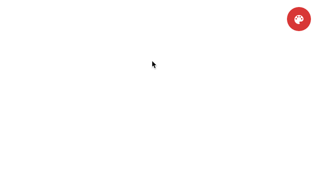

# mdColorMenu (Angular Material Color Picker) [](https://github.com/ONE-LOGIC/mdColorMenu) 

Simple color picker based on Angular Material. Colors are pre-defined by the Material Design Color Palette.
 


## Install

Download and install with [bower](http://bower.io/):
```sh
bower install md-color-menu --save
```

Add exported CSS and Javascript:
```html
<link rel="stylesheet" href="bower_components/mdColorMenu/md-color-menu.css" />
<script src="bower_components/mdColorMenu/md-color-menu.js"></script>
```

Add the module to your Angular dependencies:
```javascript
angular.module('myApp', ['mdColorMenu'])
```

## Usage

Define a color on your $scope:
```javascript
angular
  .module('myApp')
  .controller('Controller', function ($scope, mdPickerColors) {
    $scope.color = mdPickerColors[0][7]; // pick red as default color
  });
```

Pass color to `<md-color-menu>` directive and optionally watch for changes:
```html
<md-color-menu color="color">
  <md-button ng-style="color.style">Change my color</md-button>
</md-color-menu>
```
